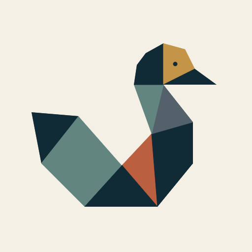

# Patitos Fortune

Public GitHub organization profile and selected deployment assets for **Patitos Fortune / Creative Software Lab**.

The live organization profile is defined in [`profile/README.md`](profile/README.md).

## Public surface

This repository is intentionally small. It contains only the files required to present the Patitos Fortune organization on GitHub, plus the approved organization-avatar export and the brand-rights notice.

The complete Brand System v1 source, generators, validation evidence, review history, and governance are maintained separately in the private canonical brand-system repository.

See [BRAND_NOTICE.md](BRAND_NOTICE.md) before reusing Patitos Fortune visual marks or artwork.
